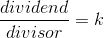
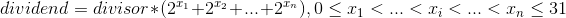

## 描述
给定两个整数，被除数 *`dividend`* 和除数 *`divisor`*.
将两数相除，要求不使用乘法、除法和 *`mod`* 运算符.

返回被除数 *`dividend`* 除以除数 *`divisor`* 得到的商.

示例 :
```
输入: dividend = 10, divisor = 3
输出: 3

输入: dividend = 7, divisor = -3
输出: -2
```
## 分析
减治

若 `dividend` 和 `divisor` 都是正整数.     
       
        
从 `dividend` 中找到最大的 `2^a * divisor`，减该值，更新 `k += 2^a`
直到 `dividend < divisor`.

边界:  `-2^32 / num`、`num / -2^32`...

## 代码
只能用 *`int`* 类型存储数据的写法，计算前就需要考虑到边界情况，而且做移位操作时也需要考虑 *`int`* 的范围.


```cpp
int divide(int dividend, int divisor) {
    if(dividend == divisor) return 1;
    if(divisor == INT_MIN) return 0;
    
    bool flag = dividend == INT_MIN;
    if(flag) dividend += abs(divisor);
    bool same = dividend >= 0 == divisor >= 0;
    dividend = abs(dividend);
    divisor = abs(divisor);
    int ans = 0;
    for (int i = 31; i >= 0; --i){
        if ((dividend >> i) >= divisor){
            ans += 1 << i;
            dividend -= divisor << i;
        }
    }
    if(flag) return same ? (ans != INT_MAX ? ans + 1 : ans) : -ans - 1;
    return same ? ans : -ans;
    
}
```
若使用 *`long`* 类型存储数据，不需要考虑移位溢出，且在最后处理边界情况.
```cpp
int divide(int dividend, int divisor) {
    long ans = 0;
    long up = fabs(dividend), down = fabs(divisor);
    while (up >= down) {
        long count = 1, base = down;
        while (up > (base << 1)) {
            count <<= 1;
            base <<= 1;
        }
        ans += count;
        up -= base;
    }
    ans = ((dividend < 0)^(divisor < 0)) ? -ans : ans;
    return  (ans > INT_MAX || ans < INT_MIN) ? INT_MAX : ans;;
}
```
 
## 参考
[LeetCode-29. 两数相除](https://leetcode-cn.com/problems/divide-two-integers/)